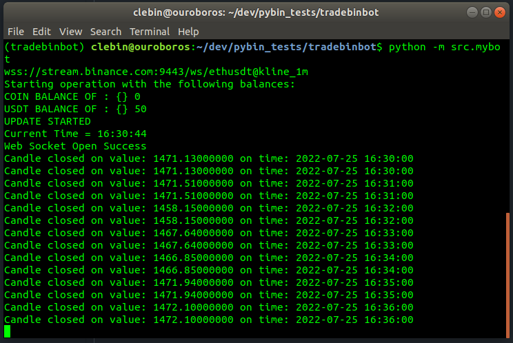
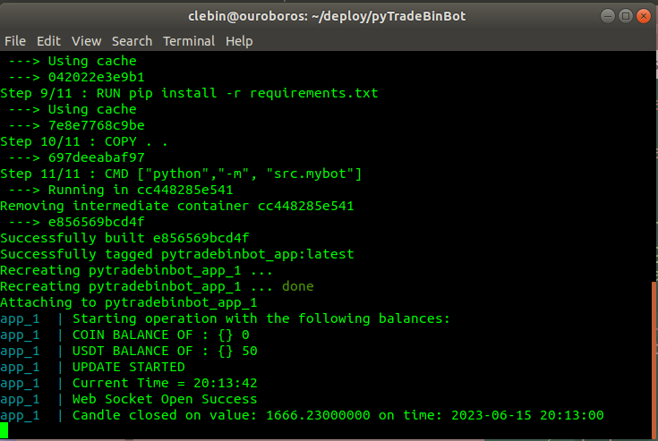
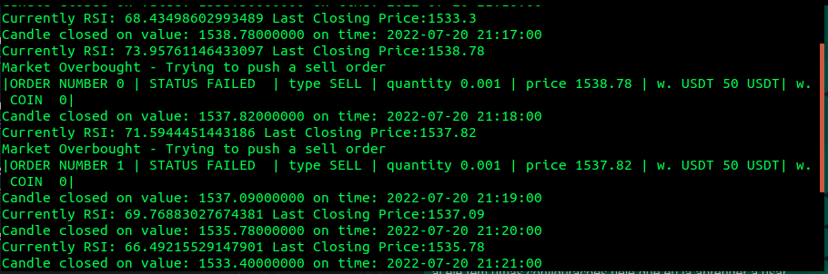

# TradeBinBot - A simple Python live trading robot

  Essa aplicação foi desenvolvida como um teste de robô de live trading com websockets e análise técnica em python 3.9.

  

## Pré-requisitos

Certifique-se de ter o Docker e o Docker Compose instalados em sua máquina.

- [Guia de instalação da Docker](https://docs.docker.com/get-docker/)
- [Guia de instalação da Docker Compose](https://docs.docker.com/compose/install/)

## Instalação

1. Clone o repositório:

```bash
git clone https://github.com/clebercoutof/meu-pytradebinbot.git
cd pytradebinbot
  ```
## Execução
1. Construa e execute o contêiner Docker:

```bash
docker-compose up --build
```


2. Após instalado, você pode executar normalmente com o comando
```bash
docker-compose up
```



## Resultados

  >Balanço final positivo em operação de demonstração com baixos valores para RSI e contratos


  Orders registered by the simulated wallet 



### Dependências
 - Python Binance v1.0.16
 - TA-lib v0.4.24
 - Python v3.9
 - GCC v7.5.0
 - Ubuntu v18.04 

> Para o detalhamento técnico dos pacotes, você pode acessar o arquivo do MANUAL.md

## Contribuição

Contribuições são bem-vindas! Sinta-se à vontade para abrir um pull request.